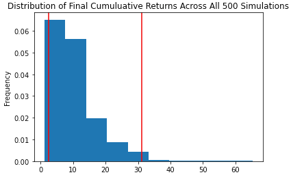

# MonteCarlo_Financial_Planner
## Portfolio Analysis and Financial Planning &amp; Forecasting using Monte Carlo Simulation and Alpaca Trade API

## Background

There are two financial analysis tools in this Jupyter notebook. The first is a personal finance planner that will allow the financial advisor to visualize client's savings composed by investments in shares and cryptocurrencies and assess if they have enough money as an emergency fund.

The second tool is a retirement planning tool that uses the Alpaca API to fetch historical closing prices for a retirement portfolio composed by stocks and bonds and runs Monte Carlo simulations to project the portfolio performance at 30 years. the outcome of the simulation model is used to address specific client needs based on whether they would like to go aggressive in their intitial investment or change the mix to achieve their retirement objectives.  

---

### Files

* [Monte_Carlo_Financial_Planner](Monte_Carlo_financial_planner.ipynb)

* [MCForecastTools toolkit](Starter_Code/MCForecastTools.py)

---

## Instructions

### Part 1 - Personal Finance Planner

The personal finance planner prototype, takes into account the following assumptions:

* The average monthly household income of the prospective clients is $12,000.

* Every prospective client has a savings portfolio composed of cryptocurrencies, stocks, and bonds.

#### Collect Crypto Prices Using the `requests` Library

Assume the following amount of crypto assets: `1.2` BTC and `5.3` ETH.

2. Use the `requests` library to fetch the current price in US dollars of bitcoin (`BTC`) and ethereum (`ETH`) using Alpaca Trade API endpoints

3. Parse the API JSON response to pick the crypto prices and store each price in a variable.

4. Compute the value in US dollars of the current amount of cryptocurrencies and print the results.

#### Collect Investments Data Using Alpaca: `SPY` (stocks) and `AGG` (bonds)

Assume the following amount of shares: `200` `AGG` (bonds) and `50` `SPY` (stocks).

1. Create the Alpaca API object using the `tradeapi.REST` function from the Alpaca SDK.

2. Format the current date as ISO format. You may change the date set in the starter code to Today's date.

3. Get the current closing prices for `SPY` and `AGG` using the Alpaca's `get_barset()` function. Transform the function's response to a Pandas DataFrame.

4. Pick the `SPY` and `AGG` close prices from the Alpaca's `get_barset()` DataFrame response and store them as Python variables. Print the closing values for validation.

5. Compute the value in US dollars of the current amount of shares and print the results.

#### Savings Health Analysis

Assess the financial health of the prospective clients.

    * If total savings are greater than the emergency fund, display a message congratulating the person for having enough money in this fund.

    * If total savings are equal to the emergency fund, display a message congratulating the person on reaching this financial goal.

    * If total savings are less than the emergency fund, display a message showing how many dollars away the person is to reach the goal of saving at least three times their monthly expenses.

### Part 2 - Retirement Planning

This tool uses Alpaca API to fetch historical closing prices for a retirement portfolio and then runa Monte Carlo simulations to project the portfolio performance at `30` years.

Use the MCForecastTools toolkit to create a Monte Carlo simulation for the retirement portfolio:

1. Use the Alpaca API to fetch five years historical closing prices for a traditional `40/60` portfolio using the `SPY` and `AGG` tickers to represent the `60%` stocks (`SPY`) and `40%` bonds (`AGG`).

2. Run a Monte Carlo Simulation of `500` runs and `30` years for the `40/60` portfolio and plot the results.

    

3. Plot the probability distribution and confidence intervals.

    

#### Retirement Analysis

Fetch the summary statistics from the Monte Carlo simulation results to answer the following questions:

1. Given an initial investment of $20,000, what is the expected portfolio return in dollars at the `95%` lower and upper confidence intervals?

2. How would a `50%` increase in the initial investment amount affect the expected portfolio return in dollars at the `95%` lower and upper confidence intervals?

3. This tool provides ability to adjust the portfolio to either include more risk (a higher stock than bond ratio) or to have a larger initial investment and rerun the retirement analysis to see what it would take to retire in `5` or `10` years instead of `30`!

---

### Resources

* [AlpacaDOCS](https://alpaca.markets/docs/)

* [Free Crypto API Documentation](https://alternative.me/crypto/api/)

---
